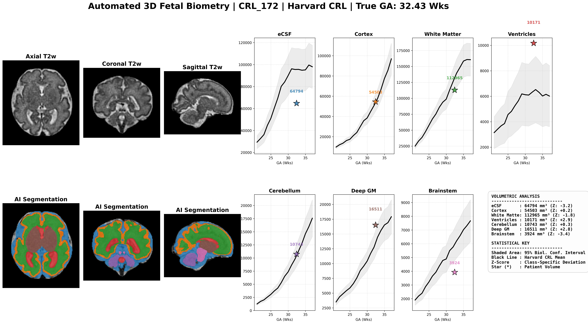

# AutoFetal-7: 3D Fetal Brain Volumetry & Z-Score Engine

**Clinical-grade nnU-Net v2 pipeline for automated 7-class fetal brain segmentation and gestational-age-conditioned Z-score reporting.**

Validated for gestational ages **22.6–33.0 weeks**. This tool provides automated volumetric analysis and normative comparisons to aid in the quantitative assessment of fetal neurodevelopment.



---

## ⚠️ CLINICAL DEPLOYMENT GUARDRAIL
> **DOMAIN SHIFT WARNING:** AutoFetal-7 was trained exclusively on GE 1.5T/3T acquisition data (FeTA 2024). Application to non-GE platforms (e.g., Siemens 3T) will result in systematic underestimation of **Brainstem** (mean Z = -2.91) and **Cerebellum** (mean Z = -2.24) volumes. Do not use these specific Z-scores for clinical decision-making in heterogeneous environments without local scanner calibration.

---

## 1. Installation
Ensure you have `conda` or `pip` installed. Clone the repository and install the strict environment dependencies:

```bash
git clone [https://github.com/DrVox100/AutoFetal7-nnUNet.git](https://github.com/DrVox100/AutoFetal7-nnUNet.git)
cd AutoFetal7-nnUNet
pip install -r requirements.txt

```
2. Download Model Weights (Zenodo): The trained nnU-Net v2 weights (244 MB) are hosted securely on Zenodo to ensure academic traceability. Download DOI: https://doi.org/10.5281/zenodo.19398110Setup: Unzip the folder.
The engine expects the standard nnU-Net directory structure: Dataset501_FetalBrain/nnUNetTrainer__nnUNetPlans__3d_fullres/fold_0/.

3. Running InferenceThe pipeline is fully vectorized and executes via the inference.py wrapper. This script handles NIfTI loading, nnU-Net prediction, and automated Z-score calculation against Harvard CRL normative baselines.

```Bash
   python inference.py \
  --input /path/to/raw_nifti_folder \
  --output /path/to/save/results \
  --weights /path/to/unzipped/AutoFetal7_Weights \
  --ga 28.5
  ```
4. Segmented Anatomical Classes:
   The model outputs a multi-label NIfTI mask with the following label indices:
   eCSF (Extra-axial Cerebrospinal Fluid),
   Cortical Gray Matter,
   White Matter (including Developmental Zones),
   Ventricles.
   CavumCerebellumDeep Gray Matter (incl. Ganglionic Eminence) and
   Brainstem
   
5. Performance Metrics Validated on a held-out Zurich cohort (N=16) and the Fidon SBA Atlas.Mean Dice Similarity can be Seen in dice score.txt for per-class breakdown.

6. Citations: If you use this tool in your research, please cite:nnU-Net: Isensee, F., et al. (2021). Nature Methods.FeTA Dataset: Payette, K., et al. (2024).Normative Atlas: Gholipour, A., et al. (2017). Scientific Reports.

7. LicenseApache 2.0. Developed by Dr. Abbu J, MD.
